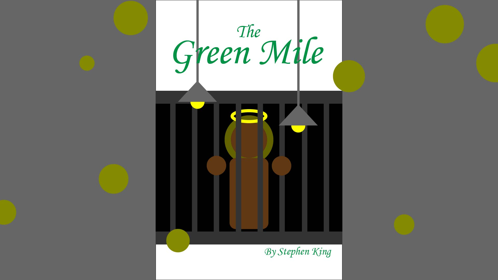

# MidTermProjectProposal

I've chosen the book "The Green Mile." Published in 1996, this fantasy novel is written by Stephen King. It mainly tells the story of a Black man named John Coffey who is wrongfully imprisoned and awaits the death penalty for the alleged rape and murder of two girls. Initially, because of his race and imposing stature, the prison guards perceive him as menacing. However, his ability to absorb pain and heal others with his supernatural power changes their views. The guards come to see him as a miracle bestowed from God. While they wish to prove his innocence, Coffey willingly faces death. He believes the world's malice causes him too much pain, and he's lost hope in it.

This novel resonated deeply with me. Many readers are awed by John's potent supernatural abilities and moved by his kindness. However, in my view, it also interweaves significant criticisms of the prevailing racism of the time. I wonder if Coffey's innocence was acknowledged solely due to his inherent goodness or was it his angelic-like powers? If he didn't possess such abilities, would the guards still view him as innocent? Would he still earn the audience's empathy? Does someone who fits the stereotypical appearance of a criminal in the public's eyes need supernatural abilities to erase those preconceptions? Or, looking from a realistic perspective, does such an individual need to sacrifice and continually give of themselves to get a chance to be reunderstood equally?

The insight I have on this book is the idea I hope to highlight in my project. From my research, most existing posters and books use the prison guard Paul as the main character because he is the central figure that push the plot forward throughout the story. However, in my work, I want John Coffey to be the main figure on the book cover. I aim for my piece to trigger the audience's emotions just as the novel does: viewers of my work will only recognize Coffey's goodness when they see him using his special power.

In essence, my project will be interactive and time-based. My plan is as follows (see the image below for reference): The screen shows Coffey locked in a cell. Every second, a random size and position of yellow-green circles (symbolizing worldly evil and suffering) appear. When users press and hold on Coffey with the mouse, he attracts all the yellow-green circles and consumes them (these circles will move towards him and disappear at his mouth's position), and a halo will appear above his head. But as soon as the user releases the mouse, the halo vanishes, the circles stop moving towards him and continue to multiply every second. I hope this interaction lets the audience feel Coffey's exhaustion and helplessness.

This time, my main topic is on how to trigger multiple animations with mouse movements. I hadn't learned arrays when studying mouse movements, so now I want to experiment using mousePressed and mouseReleased to initiate and stop animations consisting of multiple random objects. I chose this topic because I want to practice the application of coding in web interaction.

I believe my project is related to prior readings. As I mentioned earlier, most book covers feature Paul, not Coffey, the heart of the book's concept. Many readers also overlook the novel's deeper contemplation about race and appearance. Therefore, my work uses an online platform as a medium and programming as a tool to give a voice to marginalized groups. Moreover, my piece is not just a simple interaction; it aims to inspire audience reflection through an interactive experience. By exploring my work, viewers can intimately understand the perspective I want to convey. Thus, I believe I've applied the reading's theory on interactive design, focusing on the balance of "listening, expressing, and thinking."

Image on repo:  

